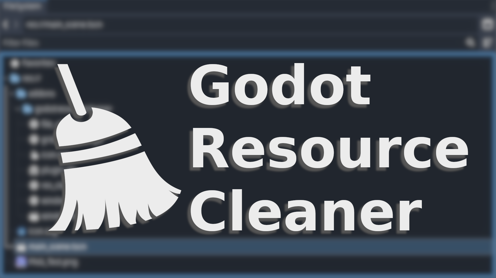
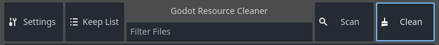
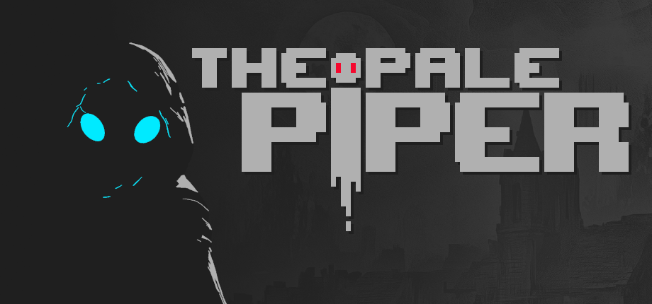

# Godot Resource Cleaner

**Resource Cleaner is a simple but powerful add-on for [Godot 4.x](https://godotengine.org/) that helps you keep your project and export builds neat and lightweight.**

## What it does:
Over time, projects accumulate unused assets. Resource Cleaner helps you identify and remove these leftovers so your project stays lean and efficient.

## With Resource Cleaner, you can:

- Scan your project for unused resources and orphaned files or folders.
- Add files you definitely don’t want to delete to the Keep List.
- Delete unnecessary files in bulk.
- Use filters to narrow down your search.

## Why it’s useful:

A clean project means less storage usage, smaller exports, faster loading times, and fewer headaches when collaborating or version control.

## Disclaimer:

⚠️ Use with caution and always make a backup before using this tool!

## Report bugs or suggest improvements:

## 💖 Wishlist my game on Steam
