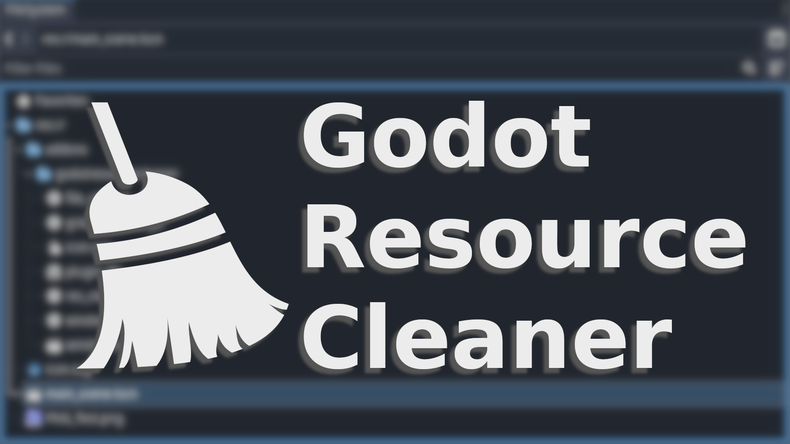
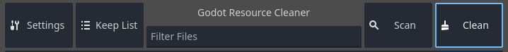
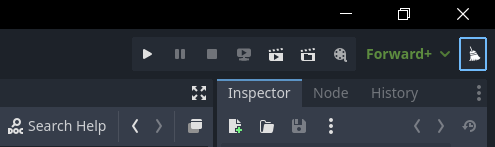

# Godot Resource Cleaner

**Godot Resource Cleaner is a simple but powerful add-on that helps you keep your project and export builds neat and lightweight.**

## What it does:
Over time, projects accumulate unused assets. Resource Cleaner helps you identify and remove these leftovers so your project stays lean and efficient.

## With Resource Cleaner, you can:

- Scan your project for unused resources and orphaned files or folders.
- Add files you definitely don’t want to delete to the Keep List.
- Delete unnecessary files in bulk.
- Use filters to narrow down your search.

## Why it’s useful:

A clean project means less storage usage, smaller exports, faster loading times, and fewer headaches when collaborating or using version control.

## Installation:

### Asset Library

- In Godot, open the `AssetLib` tab.
- Search and select "Godot Resource Cleaner".
- Download and install the plugin.
- Enable the plugin inside `Project > Project Settings > Plugins`.

### Github Releases

- Download a [release build](https://github.com/ijoschek/GodotResourceCleaner/releases/).
- Extract the zip file and place the `godotresourcecleaner` folder inside your project’s `addons` directory.
- Enable the plugin inside `Project > Project Settings > Plugins`.

### Itch.io

- Download on [itch.io](https://freetimedev.itch.io/godot-resource-cleaner)
- Extract the zip file and place the `godotresourcecleaner` folder inside your project’s `addons` directory.
- Enable the plugin inside `Project > Project Settings > Plugins`.

## Usage:

- After enabling the plugin, open Godot Resource Cleaner from the top-right corner of the editor.
- Once opened, you can start scanning your project for unused assets, add files to the Keep List, and clean your project efficiently.

## Godot 3.x Support

If you are using Godot 3.x, a community-maintained compatible version is available here:
https://github.com/navinmotion/GodotResourceCleaner/tree/godot-3.x

Huge thanks to @navinmotion for creating and sharing this branch.

## Disclaimer:

⚠️ Use with caution and make backups. This tool is provided as-is, without any warranty of any kind.